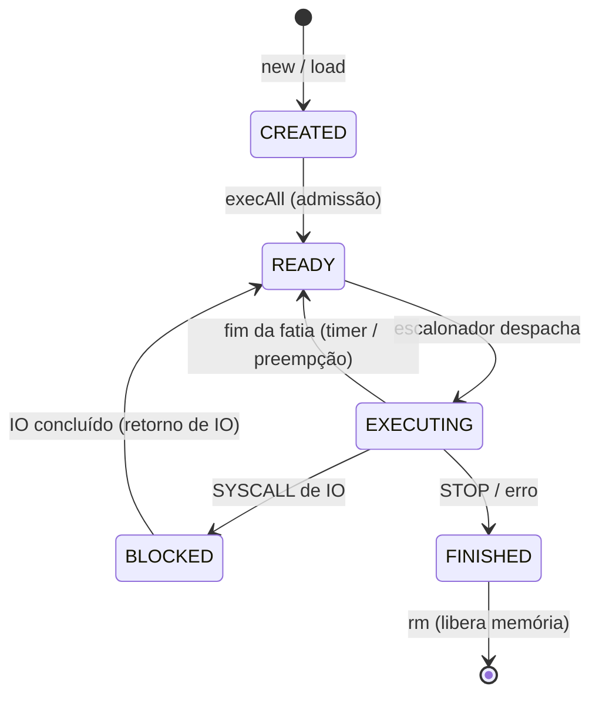

# SysOp — Documentação Técnica: Concorrência, Escalonamento e IO

> Estágio **"Multithreaded + IO"** do simulador (T1-C + IO).
> Objetivo deste documento: dar domínio técnico do que foi implementado para apresentar e defender a solução.

---

## 1. Contexto: do sequencial ao concorrente com IO

Nas primeiras partes do trabalho, o sistema era **sequencial**: a `Main` carregava um programa e a CPU o executava do início ao fim. Isso não permite simular um SO real, onde:

- vários processos disputam **uma** CPU (escalonamento), e
- um processo que pede **Entrada/Saída (IO)** não pode travar a CPU enquanto espera o dispositivo (teclado/tela) — ele deve **bloquear** e ceder a CPU a outro processo.

A solução adotada é o terceiro estágio dos diagramas da disciplina: **múltiplas threads** cooperando, com uma **fila de bloqueados** para IO. As quatro threads são:

| Thread | Papel | Onde está |
|---|---|---|
| **Shell** | Lê comandos do usuário, cria processos | `Main.commandLoop()` |
| **Escalonador** | Escolhe o próximo processo pronto e o entrega à CPU | `ProcessManager.schedulerLoop()` |
| **CPU** | Executa uma fatia de tempo do processo escolhido | `ProcessManager.cpuLoop()` + `CPU.runQuantum()` |
| **Console (IO)** | Atende as requisições de IO e devolve o processo aos prontos | `GerenciadorIO.run()` |

> **Por que threads?** Cada uma representa um "agente" assíncrono do SO real: o usuário digita quando quer, a CPU roda, o dispositivo de IO responde no seu tempo. Modelar como threads separadas torna o bloqueio por IO natural — a thread CPU fica livre enquanto a thread Console espera o teclado.

---

## 2. Modelo de três estados

Cada processo (representado por um **PCB** — `processManager/PCB.java`) percorre a seguinte máquina de estados:



| Estado (`ProcessStatus`) | Significado |
|---|---|
| `CREATED` | Criado e carregado em memória, mas **ainda não escalonável** |
| `READY` | Na **fila de prontos**, aguardando a CPU |
| `EXECUTING` | "Rodando" — é o processo na CPU |
| `BLOCKED` | Bloqueado na **fila de bloqueados**, esperando o IO terminar |
| `FINISHED` | Terminou; permanece em memória para inspeção até `rm` |

**Decisão de projeto — `new`/`load` não executam sozinhos.** A criação apenas registra o processo em `CREATED`. Só o comando `execAll` admite os processos (`CREATED → READY`) e **liga o escalonamento**. Isso dá controle didático: cria-se a carga, inspeciona-se (`ps`), e só então dispara-se o escalonamento para observar as transições.

---

## 3. Estruturas compartilhadas e sincronização

Todo o "estado do kernel" vive em `ProcessManager` e é protegido por **um único monitor** (`lock`):

```java
public final Object lock = new Object();
public List<PCB> pcbReadyList;   // fila de PRONTOS
public List<PCB> allProcesses;   // todos os processos vivos (para o ps)
public PCB running;              // processo atualmente na CPU
private boolean cpuIdle;         // CPU livre para receber um processo?
private boolean schedulingEnabled; // só despacha após execAll
private int blockedCount;        // nº de processos bloqueados em IO
private final Semaphore semaCPU = new Semaphore(0); // handoff Escalonador → CPU
```

Dois mecanismos de sincronização, com papéis distintos:

- **Monitor `lock` (`synchronized` + `wait`/`notifyAll`)** — garante **exclusão mútua** sobre as filas e flags, e permite que threads **durmam** quando não há trabalho (em vez de "rodar em vazio" gastando CPU). É o coração da coordenação.
- **Semáforo `semaCPU`** — é o **canal de entrega** do Escalonador para a CPU. Quando o Escalonador escolhe um processo, faz `semaCPU.release()`; a thread CPU estava parada em `semaCPU.acquire()` e acorda para executar a fatia. (É o `semaCPU` do enunciado.)

> **Por que os dois?** O monitor protege os dados; o semáforo sinaliza "há um processo configurado, pode rodar". Poderíamos fazer tudo com o monitor, mas o semáforo deixa explícito o ponto de handoff Escalonador→CPU, espelhando o diagrama da aula.

A fila de bloqueados aparece em dois lugares complementares:
- `GerenciadorIO.blockedProcesses` — a lista física dos bloqueados (no gerente de IO);
- `ProcessManager.blockedCount` — um **contador** dos bloqueados, usado para decidir quando o sistema ficou ocioso (ver §6).

---

## 4. As quatro threads em detalhe

### 4.1 Thread Shell — `Main`
Lê comandos em laço. Ponto-chave para IO: antes de interpretar a linha como comando, verifica se há uma **leitura de IO pendente**. Se houver, a linha digitada é **dado do programa**, não comando:

```java
if (gerenciadorIO.hasPendingRead()) {
    gerenciadorIO.deliverInput(line); // entrega ao Console
    continue;
}
```

> **Por quê?** O teclado é um recurso único. Só a Shell lê do teclado (`Scanner`); quando um processo precisa de um `READ`, a Shell **roteia** a próxima linha para o Console. Isso evita duas threads disputando `System.in`.

### 4.2 Thread Escalonador — `schedulerLoop()`
Dorme até haver o que escalonar; quando acorda, aplica **Round Robin** (pega o primeiro da fila):

```java
while (!schedulingEnabled || !cpuIdle || pcbReadyList.isEmpty())
    lock.wait();                      // dorme até ter trabalho
next = pcbReadyList.remove(0);        // RR: primeiro da fila
running = next; next.status = EXECUTING; cpuIdle = false;
logger.log(next, "escalona", "pronto", "rodando");
// fora do synchronized:
semaCPU.release();                    // entrega à CPU
```

### 4.3 Thread CPU — `cpuLoop()` + `CPU.runQuantum()`
Espera o handoff, executa **uma fatia de tempo** e decide o destino do processo conforme o resultado:

```java
semaCPU.acquire();                     // aguarda um processo
CPUStatus status = cpu.runQuantum(p);  // executa a fatia
switch (status) {
    case FINISHED:  // STOP/erro  → finalizado (memória mantida)
    case BLOCKED:   // pediu IO   → bloqueado (blockedCount++)
    case PREEMPTED: // fim da fatia → volta para o fim da fila de prontos
}
running = null; cpuIdle = true; lock.notifyAll();
```

A **fatia de tempo (quantum)** é por **contagem de instruções** (`CPU.quantum = 5`). Em `runQuantum`, a cada ciclo:

```java
if (cicle >= quantum) {                // "interrupção de timer"
    salva registradores e PC no PCB;
    return CPUStatus.PREEMPTED;
}
```

`runQuantum` salva/restaura o **contexto** (PC lógico + 10 registradores) no PCB a cada entrada/saída — é isso que permite **retomar** um processo preemptado ou desbloqueado de onde parou.

### 4.4 Thread Console (IO) — `GerenciadorIO.run()`
Consome requisições de uma fila bloqueante e atende cada uma:

```java
IORequest req = requestQueue.take();   // dorme até chegar pedido
switch (req.type) {
    case READ:  valor = readInt();      // espera o teclado (via Shell)
                memory.pos[req.physicalAddress] = DATA(valor);
    case WRITE: imprime memory.pos[req.physicalAddress].p;
}
ioReturn(req.process);                  // desbloqueia e devolve aos prontos
```

---

## 5. O fluxo completo de uma operação de IO

Este é o ponto central da entrega. Acompanhe um `READ` (entrada):

```mermaid
sequenceDiagram
    participant P as Programa (na CPU)
    participant SC as SysCallHandling
    participant PM as ProcessManager
    participant Q as requestQueue
    participant C as Thread Console
    participant SH as Shell (teclado)

    P->>SC: SYSCALL (reg[8]=1 READ, reg[9]=end. lógico)
    SC->>SC: traduz lógico → físico (page table)
    SC->>PM: status = BLOCKED, addBlockedProcess
    SC->>Q: submit(IORequest READ)  [pendingReads++]
    SC-->>P: requestBlock() → CPU para a fatia (BLOCKED)
    Note over PM: cpuLoop: blockedCount++, CPU fica livre,<br/>escalonador roda OUTRO processo
    C->>Q: take() recebe a requisição
    C->>SH: aguarda linha (inputChannel)
    SH->>C: usuário digita → deliverInput(valor)
    C->>PM: grava valor na memória física; unblockProcess()
    Note over PM: BLOCKED → READY (retorno de IO),<br/>escalonador volta a considerá-lo
```

Passo a passo, com os arquivos:

1. **Programa pede IO** (`Sistema.CPU`, opcode `SYSCALL`). Convenção: `reg[8]` = operação (`1`=READ, `2`=WRITE), `reg[9]` = **endereço lógico** do inteiro.
2. **Tratamento da syscall** (`Sistema.SysCallHandling.handle`):
   - **traduz** o endereço lógico→físico **agora**, enquanto o processo ainda é o "atual" da CPU (a tabela de páginas está acessível);
   - marca o processo `BLOCKED`, adiciona à fila de bloqueados e **enfileira** um `IORequest` (com endereço lógico para mensagens e físico já traduzido);
   - chama `requestBlock()` → a CPU encerra a fatia retornando `BLOCKED` (sem finalizar o processo).
3. **A CPU fica livre** (`cpuLoop`): `blockedCount++`, `cpuIdle = true`, acorda o escalonador → **outro** processo roda. A CPU **não** fica esperando o IO.
4. **A Thread Console** (`GerenciadorIO`) pega o pedido:
   - `READ`: imprime o prompt e espera a linha do teclado; o valor é gravado na **memória física** do processo;
   - `WRITE`: lê o valor já presente na memória física e imprime na tela.
5. **Retorno de IO** (`GerenciadorIO.ioReturn` → `ProcessManager.unblockProcess`): `blockedCount--`, o processo volta a `READY` (transição "retorno IO") e o escalonador é acordado. Ele será retomado de onde parou.

> **Por que traduzir o endereço na syscall e não no Console?** A tradução depende da **tabela de páginas do processo** e do "processo atual" da CPU. A Thread Console não tem esse contexto — ela é genérica. Traduzir **antes de enfileirar** desacopla o dispositivo do gerenciamento de memória: o Console só vê um endereço físico pronto para usar.

### Por que dois tipos de fila no IO?
- `requestQueue` é uma `LinkedBlockingQueue<IORequest>`: vários pedidos podem se acumular; o Console os atende **um a um, em ordem** (serializa o acesso ao dispositivo).
- `inputChannel` é uma `SynchronousQueue<String>`: é um **rendez-vous** — a Shell só entrega a linha quando o Console está de fato esperando por ela, e vice-versa. Isso casa exatamente uma digitação com uma leitura pendente.
- `pendingReads` (`AtomicInteger`) diz à Shell se a próxima linha é **dado** (há leitura pendente) ou **comando**.

---

## 6. Detalhes finos de coordenação (decisões e porquês)

**Gate de escalonamento (`schedulingEnabled`).** O escalonador só despacha após `execAll`. Quando o sistema esvazia (nada pronto, nada executando e `blockedCount == 0`), o `cpuLoop` **desliga** o escalonamento:

```java
if (pcbReadyList.isEmpty() && blockedCount == 0) {
    schedulingEnabled = false;  // volta ao ocioso
    System.out.println("... Escalonamento encerrado ...");
}
```
Assim, depois que uma carga termina, criar um novo processo (`new`) volta a apenas alocar — não dispara execução sozinho.

> **Por que checar `blockedCount` aqui?** Se a fila de prontos esvaziou mas há um processo **bloqueado** em IO, o sistema **não** está ocioso: aquele processo vai voltar. Desligar o escalonamento nesse momento o deixaria órfão. O `blockedCount` mantém o escalonamento ligado até o último IO retornar.

**Retenção de memória ao finalizar.** No caso `FINISHED`, **não** se chama `deallocate`: o processo fica em `allProcesses` como `FINISHED`, com seus frames carregados. Motivo: permitir inspecionar a memória após a execução (ex.: conferir, via `dumpP`, que um valor lido foi gravado na posição lógica correta). A liberação é **voluntária**, via `rm <pid>`. É seguro porque `MemoryManager.allocate` só usa frames livres — uma nova carga nunca sobrescreve um processo retido.

**Sem condições de corrida / deadlock.** Toda alteração de fila/flag ocorre dentro de `synchronized (lock)`. As threads dormem em `wait()` e só são acordadas por `notifyAll()` após uma mudança de estado relevante. O `semaCPU.release()` é feito **fora** do bloco sincronizado para não segurar o lock durante o handoff.

---

## 7. Tradução de endereços (paginação) — recapitulação

Programas são escritos com endereços **lógicos** contíguos (0, 1, 2, …). A memória física é dividida em **frames** de `pageSize` (padrão 16) palavras. A tabela de páginas do PCB mapeia página→frame:

```
endereço lógico  L
página   = L / pageSize
offset   = L % pageSize
físico   = pages[página].frame.start + offset
```

Toda instrução que acessa memória (`LDD/STD/LDX/STX`, desvios `*M`) e a syscall de IO passam por `CPU.translate()`. O comando **`dumpP <pid>`** percorre o espaço lógico do processo aplicando essa fórmula e imprime `lógico → físico → conteúdo`, tornando a verificação visual e independente de os frames serem contíguos.

---

## 8. Log de transições de estado (`escalonamento.log`)

Toda mudança de estado é registrada **em arquivo** por `StateLogger`, no formato pedido:

```
ID | Nome do prog | Razao | Estado ini | Prox estado | Tabela de paginas [pag,frame]
```

| Razão | Transição | Onde é gerada |
|---|---|---|
| `criacao` | nulo → criado | `register()` |
| `admissao` | criado → pronto | `execAll()` |
| `escalona` | pronto → rodando | `schedulerLoop()` |
| `fatia tempo` | rodando → pronto | `cpuLoop` (PREEMPTED) |
| `solicita IO` | rodando → bloqueado | `cpuLoop` (BLOCKED) |
| `retorno IO` | bloqueado → pronto | `unblockProcess()` |
| `stop` | rodando → finalizado | `cpuLoop` (FINISHED) |

Decisões: o log é **persistente** (modo *append*, cabeçalho só quando o arquivo está vazio) para consulta após o `execAll`; **não** há mais impressão dessas transições no console (a informação fica só no arquivo); o usuário pode esvaziá-lo com **`clearLog`**. O acesso é sincronizado porque as transições vêm de **várias threads**.

---

## 9. Comandos do menu

| Comando | Efeito |
|---|---|
| `new <programa>` | Cria 1 processo (estado `CREATED`); **não** executa |
| `load <n>` | Cria uma **carga** de `n` processos (1 de entrada, 1 de saída, demais sem IO) e lista; não executa |
| `execAll` | Admite os criados (`→ READY`) e **liga o escalonamento** (Round Robin) |
| `ps` | Lista todos os processos e seus estados |
| `dump` | Dump da memória física inteira |
| `dumpM` | Estado do gerenciador de memória (frames livres/ocupados) |
| `dumpP <pid>` | Dump da memória de **um** processo em ordem **lógica** (mostra lógico→físico) |
| `rm <pid>` | Remove o processo e **libera** sua memória |
| `clearLog` | Esvazia o arquivo `escalonamento.log` |
| `traceOn` / `traceOff` | Liga/desliga o trace de instruções da CPU |
| `exit` | Encerra |

### A carga (`load <n>`) e a fila de bloqueados
A carga é montada na ordem **entrada → saída → demais**, propositalmente:

- **1º** `fibonacciREAD` (faz `READ`): bloqueia **cedo**, logo no início, esperando o teclado;
- **2º** `fatorialV2` (faz `WRITE`): calcula e depois escreve;
- **demais**: programas sem IO (`PB`, `progMinimo`, …).

> Colocar o processo de **entrada antes** do de saída evidencia a fila de bloqueados: o de entrada bloqueia primeiro e fica aguardando, enquanto os demais continuam rodando — exatamente o comportamento que se quer demonstrar.

---

## 10. Roteiro de demonstração sugerido

```text
load 4        # cria 4 processos e lista (todos CREATED)
ps            # confirma os estados CREATED
execAll       # dispara o escalonamento (Round Robin)
7             # valor para o READ do fibonacciREAD (quando o prompt [Console] IN aparecer)
ps            # após terminar: todos FINISHED (memória retida)
dumpP 0       # confirma que o valor 7 foi salvo na posição lógica 55
# (abrir escalonamento.log para mostrar TODAS as transições de estado)
clearLog      # opcional: limpa o log para uma próxima demonstração
```

---

## 11. Perguntas prováveis na defesa (Q&A)

**Por que múltiplas threads em vez de um laço sequencial?**
Para que o bloqueio por IO seja real: a CPU fica livre durante a espera do dispositivo e roda outro processo. Cada thread modela um agente assíncrono do SO (usuário, escalonador, CPU, dispositivo).

**O que acontece se dois processos pedirem IO "ao mesmo tempo"?**
Os pedidos entram na `requestQueue` e o Console os atende **em ordem, um a um**. O acesso ao dispositivo é serializado; os processos ficam todos na fila de bloqueados até serem atendidos.

**Como o teclado é compartilhado entre digitar comandos e fornecer dados de leitura?**
Só a Shell lê o teclado. Se `hasPendingRead()` é verdadeiro, a linha é **roteada** ao Console via `inputChannel` (rendez-vous); senão é interpretada como comando. Isso evita duas threads disputando `System.in`.

**Por que traduzir o endereço lógico→físico na syscall, e não no Console?**
A tradução depende da tabela de páginas do processo atual; o Console é genérico e não tem esse contexto. Traduzir antes de enfileirar desacopla dispositivo de gerência de memória.

**Por que `semaCPU` (semáforo) além do monitor `lock`?**
O monitor protege os dados compartilhados; o semáforo é o **sinal de handoff** Escalonador→CPU ("há um processo pronto para a fatia"). Separa claramente "proteger dados" de "acordar a CPU".

**Por que `blockedCount` em vez de `blockedProcesses.size()`?**
`blockedCount` vive no `ProcessManager` (junto das filas e do `lock`) e é usado para decidir a ociosidade do sistema sem precisar sincronizar com o `GerenciadorIO`. Evita acoplar a decisão de escalonamento ao estado interno do gerente de IO.

**Como funciona a preempção (Round Robin)?**
Por **contagem de instruções**: a CPU executa até `quantum` (5) instruções; ao atingir o limite, salva o contexto no PCB e retorna `PREEMPTED`. O `cpuLoop` recoloca o processo no **fim** da fila de prontos.

**O processo bloqueado perde o que já calculou?**
Não. `runQuantum` salva PC lógico e os 10 registradores no PCB ao sair; ao ser reescalonado, o contexto é restaurado e ele continua de onde parou.

**Por que a memória não é liberada quando o processo termina?**
Para permitir inspeção pós-execução (`dumpP`, `dump`). A liberação é voluntária (`rm`). Não há risco de corrupção: `allocate` só usa frames livres.

**Há risco de deadlock ou starvation?**
Toda mutação ocorre sob `lock`, com `wait`/`notifyAll` disciplinados; o `release` do semáforo é feito fora do lock. Round Robin (fila FIFO de prontos) garante que todo processo pronto eventualmente roda — sem starvation.

---

## 12. Mapa de arquivos

| Arquivo | Responsabilidade |
|---|---|
| `src/Main.java` | Thread Shell: menu, criação das threads, roteamento de teclado para IO |
| `src/processManager/ProcessManager.java` | Estado do kernel, threads Escalonador e CPU, filas, transições, `load`/`dumpP` |
| `src/processManager/PCB.java` | Bloco de controle do processo (id, estado, páginas/frames, contexto salvo) |
| `src/processManager/ProcessStatus.java` | Enum dos estados |
| `src/processManager/StateLogger.java` | Log persistente das transições em `escalonamento.log` |
| `src/io/GerenciadorIO.java` | Thread Console: filas de IO, leitura/escrita, retorno de IO |
| `src/io/IORequest.java` | Requisição de IO (processo, tipo, endereço lógico e físico) |
| `src/system/Sistema.java` | HW (CPU, memória, `runQuantum`), syscalls de IO, opcodes, tradução de endereço |
| `src/memoria/MemoryManager.java` | Paginação física: `allocate`/`deallocate` de frames |
| `src/memoria/Page.java`, `Frame.java` | Página lógica e frame físico |
```
